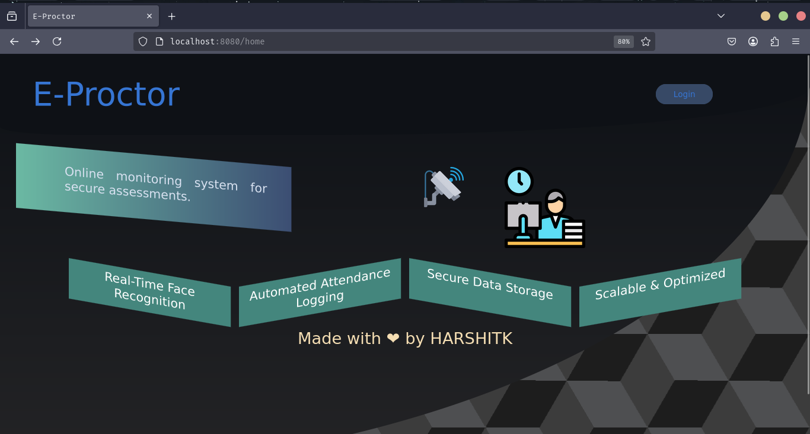
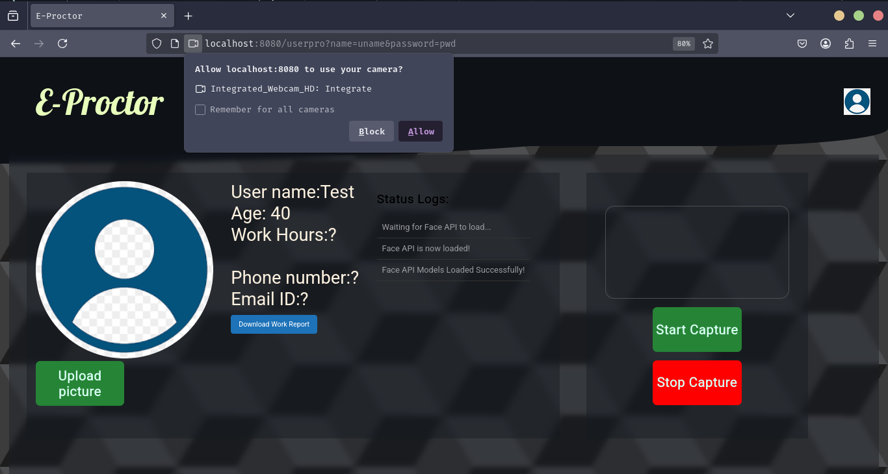
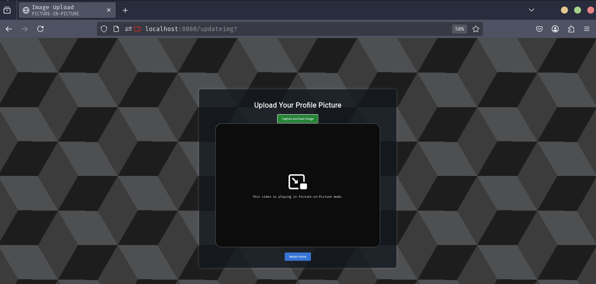
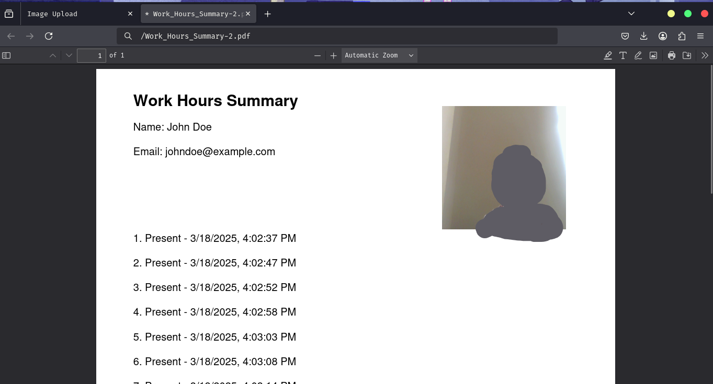

# **Employee Entry Management System**  

🚀 **Revolutionize employee attendance tracking with real-time face recognition!**  

This web application leverages **cutting-edge face recognition technology** to record employee presence in real-time, log entries, and generate exportable **PDF reports**. Perfect for modern workplaces!  

---

## **✨ Key Features**  
✅ **Upload User Image for Recognition**  
✅ Real-time **face recognition** with high accuracy  
✅ Automatic logging of entry timestamps  
✅ Export logs to **PDF format** for easy reporting  
✅ Intuitive web-based interface  

---

## **🚀 Deployment Instructions**  

### **Prerequisites**  
Before you begin, ensure the following are installed on your system:  
- **Node.js** (Download from [nodejs.org](https://nodejs.org))  
- **npm** (Comes bundled with Node.js)  

---

### **🛠️ Installation Steps**  

1. **Clone the Repository** (If using Git):  
   ```sh
   git clone https://github.com/your-username/Employee-Entry-Management.git
   cd Employee-Entry-Management
   ```

2. **Install Dependencies:**  
   ```sh
   npm install
   ```

3. **Setup Environment Variables:**  
   - Create a `.env` file in the project root directory.  
   - Add the following configuration:  
     ```js
     PORT=8080
     ```

4. **Start the Server:**  
   ```sh
   node index.js
   ```

5. **Access the Application:**  
   - Open your browser and navigate to:  
     ```
     http://localhost:8080
     ```

---

### **📸 Usage Guide**  

1. **Click Login to Enter:**  
   - Note: Authentication is currently a dummy page for demonstration purposes.  
   

2. **Allow Web Camera Access:**  
   - Grant camera access when prompted by your browser.  
   

3. **Upload User Image for Face Recognition:**  
   - Navigate to:  
     ```
     http://localhost:8080/updateimg
     ```  
   - Upload your profile image (e.g., "user.png") to the designated folder (e.g., `/uploads`).  
   - This image will be used for **face matching** during entry detection.  
   - Click **Upload** to proceed.  
   

4. **Start Face Recognition:**  
   - Click **Start Capture** to begin real-time face recognition.  
   - The system will detect your presence and update the **Work History** section.  

5. **Download Work Report as PDF:**  
   - Click **Download Report** to export the attendance log as a PDF.  
   - The PDF will be saved to your device.  
   

---

## **💻 Technology Stack**  
- **Frontend:** HTML, CSS, JavaScript, EJS  
- **Backend:** Node.js, Express.js  
- **Face Recognition:** `face-api.js`  

---

<h3 align="left">🛠️ Languages and Tools:</h3>
<p align="left">
  <a href="https://www.w3schools.com/css/" target="_blank" rel="noreferrer">
    
  </a> 
  <a href="https://expressjs.com" target="_blank" rel="noreferrer">
    
  </a> 
  <a href="https://www.w3.org/html/" target="_blank" rel="noreferrer">
    
  </a> 
  <a href="https://developer.mozilla.org/en-US/docs/Web/JavaScript" target="_blank" rel="noreferrer">
    
  </a> 
  <a href="https://nodejs.org" target="_blank" rel="noreferrer">
    
  </a>
</p>

---

## **🚀 Future Enhancements**  
- ✅ Add user authentication for secure access  
- ✅ Store logs in a database for long-term tracking  
- ✅ Generate detailed analytics and insights  
---

## **🤝 Contributions Welcome!**  
Feel free to open an **issue** or submit a **pull request** to contribute to this project. Let’s build something amazing together! 🚀  
---
